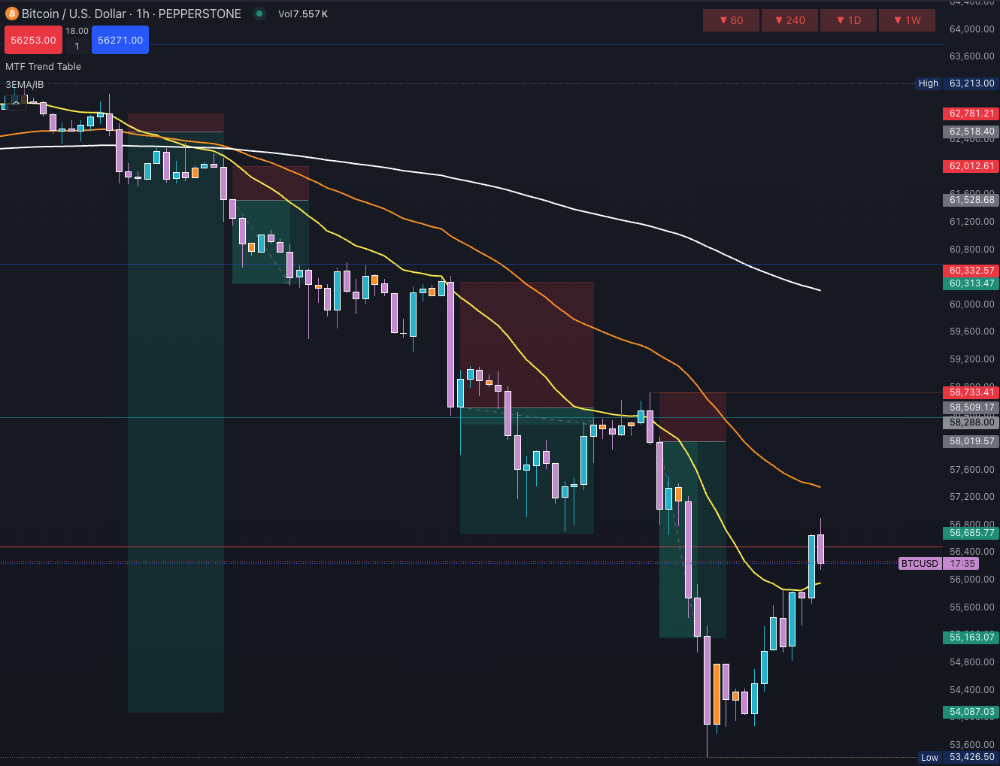
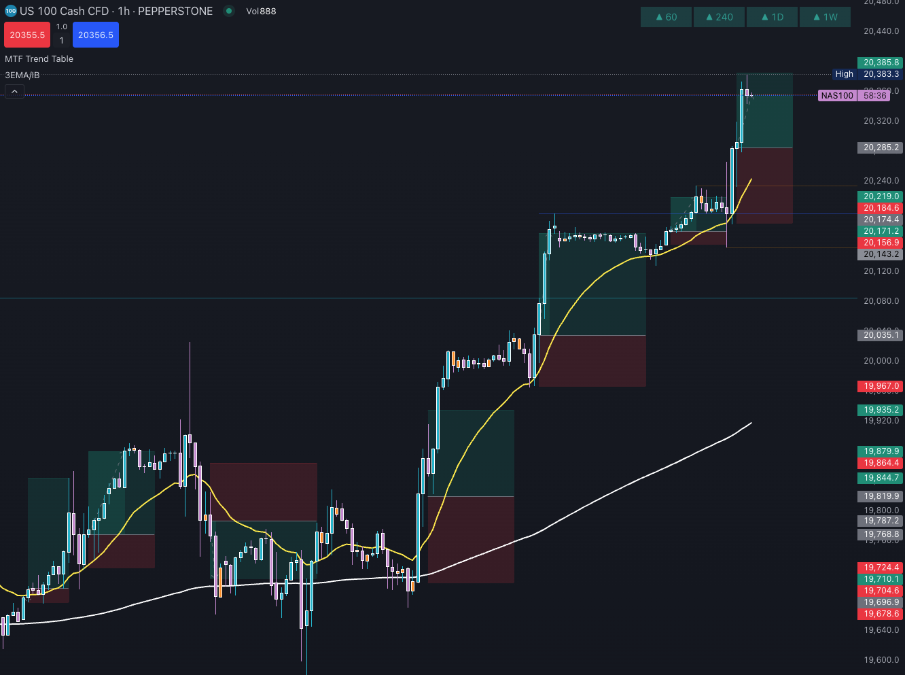

# Moving Average (MA)

An exponential moving average (EMA) is a type of moving average that gives more weight to recent price data, making it more responsive to price changes compared to a simple moving average (SMA). EMAs are widely used by traders to identify trends, reversals, and potential entry or exit points in the market. The script plots three EMAs with different periods to capture short-term, medium-term, and long-term trends.

Personally, I mainly use the 20 and 200 EMA to confirm the trend direction and often take trades near the 20 EMA.

As you can see in the picture above, the price is below the 200 EMA and the 20 EMA is acting as resistance. If you had taken a trade when the price first went through the 20 EMA, you could have achieved a risk/reward ratio of 1:34. There were many good trading opportunities in this downtrend.

I want to see the price break through the 20 EMA with a big strong candle, bounce from the 20 EMA with an engulfing candle, or show a color change (two candles together are bigger than the last different color candle).

My entry is after the next candle opens following confirmation, and I like to see that the new candle is forming the same color as the previous one.

The risk/reward ratio should always be at least 1:1, but I prefer 1:2 or more. If my confirmation candle is long, then I use a 1:1 risk/reward ratio because there might be a strong pullback or consolidation later.

If the 20 EMA crossover candle is small, you should wait for a 20 EMA retest before entry because the price could change its direction.

## Signals

I have done tests with a 5-minute chart on how to get good and reliable signals. The current code uses MACD, RSI and moving average (3) crossover to confirm signals.

This gives less bad signals, but there are still some, and in my opinion, the signals are too late. I recommend making sure that the open candle goes in the same direction as the singal before trading.

### LONG

- MACD is above Signal line.
- RSI line is above MA and above 20.
- Last candle opened below MA2 / MA3 and closed above it.
- Last candle must be bigger than previous candle.

### SHORT

- MACD is below Signal line.
- RSI line is below MA and below 80.
- Last candle opened above MA2 / MA3 and closed below it.
- Last candle must be bigger than previous candle.