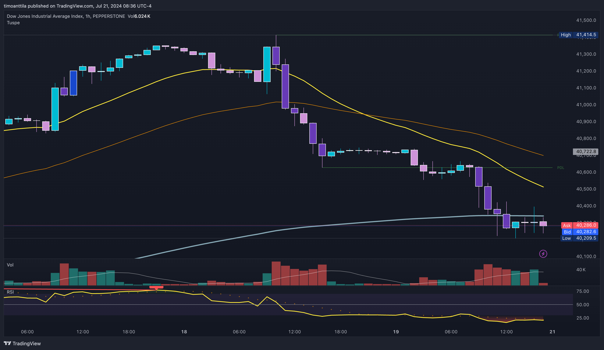
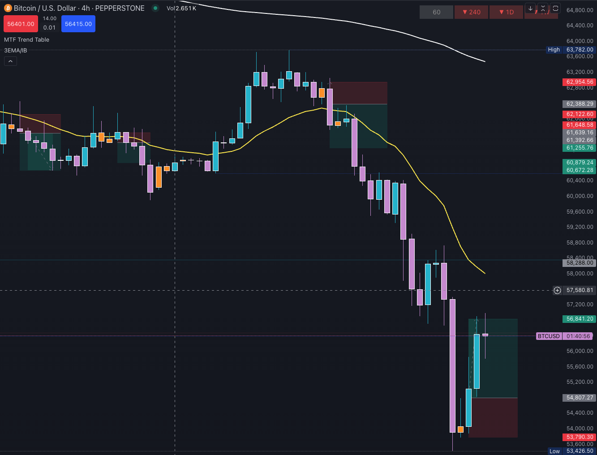

# Tuspe Special Mix v1.0

The script is designed for use on [TradingView](https://www.tradingview.com/), a popular platform for traders to perform technical analysis and execute trades. This script combines four technical analysis tools: previous daily high and low, volume, [exponential moving averages (EMAs)](https://www.investopedia.com/terms/m/movingaverage.asp), and [inside bar patterns](https://www.tradingheroes.com/inside-bar-pattern-explained/).

The previous daily high and low provide key support and resistance levels, crucial for understanding potential price reversals or breakouts. Moving averages help identify trend direction, while inside bar patterns signal potential price consolidation and breakout points.

Since TradingView only offers two indicators for free users, I combined the strategies I use into one indicator.

The script is made and managed by [Timo Anttila](https://timoanttila.com/). The script is free to use and modify, but please let's update this script together instead of creating a new one. If you have any suggestions or improvements, please let me know.

## Exponential Moving Average (EMA)

An exponential moving average (EMA) is a type of moving average that gives more weight to recent price data, making it more responsive to price changes compared to a simple moving average (SMA). EMAs are widely used by traders to identify trends, reversals, and potential entry or exit points in the market. The script plots three EMAs with different periods to capture short-term, medium-term, and long-term trends.

Personally, I mainly use the 20 and 200 EMA to confirm the trend direction and often take trades near the 20 EMA.

As you can see in the picture above, the price is below the 200 EMA and the 20 EMA is acting as resistance. If you had taken a trade when the price first went through the 20 EMA, you could have achieved a risk/reward ratio of 1:34. There were many good trading opportunities in this downtrend.

I want to see the price break through the 20 EMA with a big strong candle, bounce from the 20 EMA with an engulfing candle, or show a color change (two candles together are bigger than the last different color candle).

My entry is after the next candle opens following confirmation, and I like to see that the new candle is forming the same color as the previous one.

The risk/reward ratio should always be at least 1:1, but I prefer 1:2 or more. If my confirmation candle is long, then I use a 1:1 risk/reward ratio because there might be a strong pullback or consolidation later.

If the 20 EMA crossover candle is small, you should wait for a 20 EMA retest before entry because the price could change its direction.

## Inside Bar

An inside bar is a two-candlestick pattern where the second candle's high and low are completely contained within the high and low of the first candle. Inside bars indicate a period of consolidation or indecision in the market, often preceding a breakout or reversal. The script identifies inside bars on the chart and highlights them for easier recognition.

## Previous Daily High and Low

Using the previous day's high and low can provide key insights for trading decisions, offering important support and resistance levels. These levels help traders identify potential price reversals, breakouts, and areas to place stop-loss orders, thus improving trading strategies.

### Support and Resistance Levels

**Support**: The previous day's low can act as a support level. If the price approaches this level and holds, it may be a good point to enter a long position, anticipating a bounce.

**Resistance**: The previous day's high can act as a resistance level. If the price approaches this level and fails to break through, it might be a good point to enter a short position, anticipating a pullback.

### Breakout Trading

**Bullish Breakout**: A price break above the previous day's high with strong volume can indicate a bullish breakout. Traders may enter a long position, expecting the upward momentum to continue.

**Bearish Breakdown**: A price break below the previous day's low with strong volume can indicate a bearish breakdown. Traders may enter a short position, expecting the downward momentum to continue.

**False Breakouts**: Sometimes the price may break the previous day's high or low but then quickly reverse. These false breakouts can be used to enter trades in the opposite direction, anticipating that the initial move was a trap.

### Range Trading

When the price moves between the previous day's high and low, traders can use these levels to trade within the range. Buying near the low and selling near the high can be an effective strategy in a ranging market.

### Stop-Loss Placement

Setting stop-loss orders just below the previous day's low for long positions or just above the previous day's high for short positions can help manage risk. This ensures that if the price moves against the position, losses are minimized.

### Example video

## Volume Colors for High Volume Candles

Color-coded volume candles provide traders with enhanced visual clarity, allowing them to quickly identify market sentiment and momentum. By using different colors for bullish and bearish candles, traders can instantly discern whether the market activity is predominantly buying or selling, without having to analyze numerical volume data. This immediate recognition aids in making more informed and timely trading decisions.

## Alerts

The script includes several alert conditions to notify traders of key events:

**Previous Day High/Low Breakout**: An alert is triggered when the price breaks above the previous day's high or below the previous day's low, indicating a potential breakout.

**Inside Bar Formation**: An alert is triggered when a new inside bar pattern is identified, signaling a potential consolidation or breakout.

**High Volume Candle**: An alert is triggered when the volume exceeds a specified threshold, highlighting significant market activity.

These alerts help traders stay informed of important market movements and make timely trading decisions.
