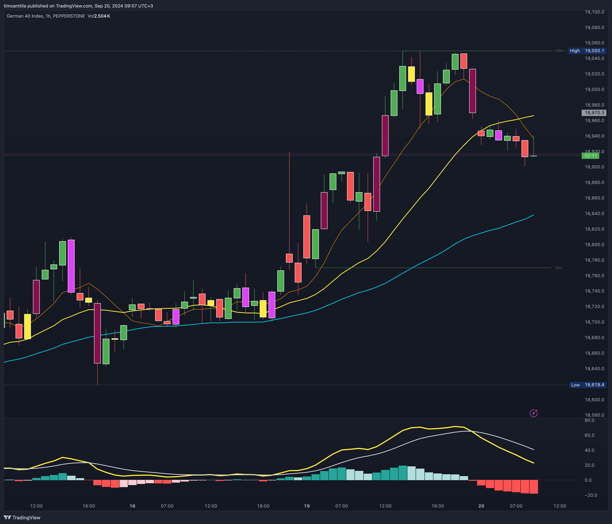

# Tuspe Special Mix v1.0

The script is designed for use on [TradingView](https://www.tradingview.com/), a popular platform for traders to perform technical analysis and execute trades. This script combines popular technical analysis tools like moving averages, candlestick identifier, previous day alerts and trade signals.

Since TradingView only offers two indicators for free users, I combined the strategies I use into one indicator.

The script is made and managed by [Timo Anttila](https://timoanttila.com/). The script is free to use and modify, but please let's update this script together instead of creating a new one. If you have any suggestions or improvements, please let me know.

## Indicators

- [Elephant Bar](./ElephantBar.pine)
- [Moving averages](./MovingAverages/)
- [Previous day alerts and lines](./PreviousDay/)
- [TheStrat](./TheStrat/)

## Candlestick Identifier

The script can recognize three different candlestick shapes; inside bar (1, yellow), outside bar (3, purple) and Displacement / Elephant Bar (maroon). The first two are used in [TheStrat](./TheStrat/) strategy and the third shows the strength of the trend.

## Alerts

- Displacement / Elephant Bar
- Displacement / Elephant Bar or Inside Bar
- Inside Bar
- Outside Bar
- Price is near previous day high
- Price is near previous day low
- Price is near previous day high or low