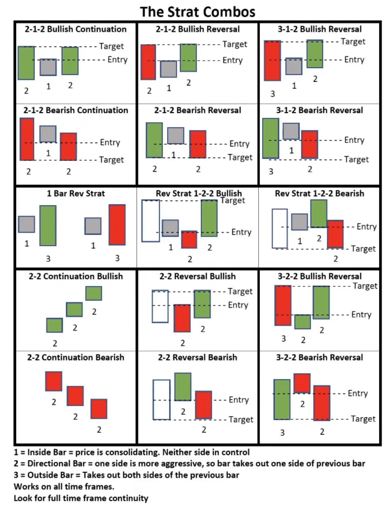

# TheStrat - a clear and effective trading strategy

TheStrat, created by [Rob Smith](https://x.com/robintheblack) after more than 30 years of trading experience, is a straightforward and effective price action trading strategy. It helps traders find high-probability trades by analyzing price movements on multiple timeframes. The strategy also highlights the importance of managing risk and aims to identify trades that match the overall market trend with a good risk-to-reward ratio.

An inside bar is a two-candlestick pattern where the second candle's high and low are completely contained within the high and low of the first candle. Inside bars indicate a period of consolidation or indecision in the market, often preceding a breakout or reversal.

Good setups for beginners are 2-1, 3-1, and actionable signal setups.

## The Strat Combo Sheet

## Candle Numbering

The chart will automatically number candles based on their relationship to the previous candle. It assigns the number `1` for an inside bar, `2` for a directional bar (up or down), and `3` for an outside bar. This allows for quick visual recognition of candle patterns.

### Candle Coloring

The candles will be highlighted based on specific patterns:

- **Yellow**: Indicates an inside candle.
- **Magenta**: Indicates an outside candle.
- **Red**: Indicates a `2d` candle.
- **Green**: Indicates a `2u` candle.
- **Maroon**: Indicates that candle is very strong.

These colors are applied without modifying the candle's outer border, so you can still see if the candle was bullish (green) or bearish (red) based on the open and close.

## Learn more about TheStrat

- [What is #TheStrat? (WORKING TRADING STRATEGY) 2024](https://www.youtube.com/watch?v=0uiWWbOrtj4)
- [The Strat Overview](https://www.youtube.com/playlist?list=PLggReKMQs3PJXWdti9J6zDtP1gQwCn2vO)
- [The STRAT - Win With This Charting Method](https://www.youtube.com/watch?v=LBXlx07XwUI)
- [Only TheStrat Patterns Trading Guide You Will Ever Need!!](https://www.youtube.com/watch?v=jKzKqzRooZc)
- [#TheStrat Basics. As easy as 1-2-3!](https://www.youtube.com/watch?v=3XdOyquBhSU)
- [FTFC & Multiple Time Frame Analysis #TheStrat](https://www.youtube.com/watch?v=Igf8Rrf8Ou0)
- [#TheStrat! Actionable Signals! Must watch!](https://www.youtube.com/watch?v=1EwK7jUgL-s)
- [TheSTRAT for 100% Mechanical Trading Strategy](https://www.youtube.com/watch?v=RNP18fVDZ54)